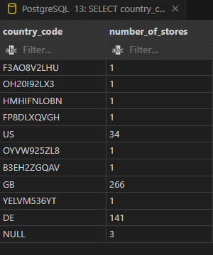
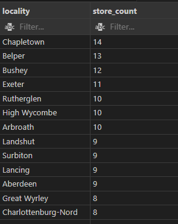
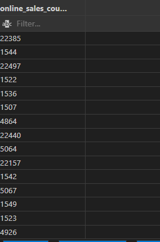

# Multinational-retail-data-centralisation807

### Description

This project involves the application of object-oriented programming to deploy the concept of classes and objects to structure and create instances for data extraction and cleaning. 

#### Usage

In this project, 3 clases are created which include database utilities, data extraction and data cleaning.  The database utilities class contains methods used for storing database and connecting to databases. The data extraction class contains methods to extract data from different types of sources, such as pdf files, an S3 bucket and an RDS database. While the The data cleaning class contains the methods to clean/verify all the data in each tables. 

### Milestone 1 

Setup Github 

### Milestone 2 Extract and clean the data from data sources

#### Task 1 

Setup database called sale_data within pgadmin4 to store data

#### Task 2  initialise 3 project classes 

##### Step 1  database_utils.py

class DatabaseConnector:

#####  step 2 data_extraction.py

Class DataExtraction:

##### step 3 data_cleaning.py

Class DataCleaning:

#### Task 3  Extract and clean the user data

##### Step 1  

create  yaml file db_creds.yaml containing the credentials below

.gitignore db_creds.yaml

RDS_HOST ="data-handling-project-readonly.cq2e8zno855e.eu-west-1.rds.amazonaws.com"
RDS_PORT = 5432
RDS_DATABASE ='postgres'
RDS_PASSWORD ='AiCore2022'
RDS_USER ='aicore_admin'
DATABASE_TYPE = 'postgresql'
DBAPI = 'pyscopg2'

##### Step 2 read_db_creds method to read the yaml credentials 
import yaml

class DatabaseConnector:

    def read_db_creds(self):
      
      # read_db_creds in db_creds.yaml, reads and returns a dictionary of the credentials.
      with open("db_creds.yaml", 'r') as file:
        read_db_creds = yaml.safe_load(file)
             
        #print(read_db_creds)

    Creating an instance 

      __init__ is the constructor

    def __init__(self, RDS_HOST, RDS_PORT, RDS_DATABASE, RDS_USER, RDS_PASSWORD):
        self.RDS_HOST = RDS_HOST
        self.RDS_PORT = RDS_PORT
        self.RDS_DATABASE = RDS_DATABASE
        self.RDS_USER = RDS_USER
        self.RDS_PASSWORD = RDS_PASSWORD
        
       
    creating a class instance

    def database_connector(loader, node):
        values = loader.connect_mapping(node)
        return DatabaseConnector(values['RDS_HOST'], values['RDS_PORT'], values['RDS_DATABASE'], values['RDS_USER'], values['RDS_PASSWORD'])

   
        #print(read_db_creds)

#Creating an instance of the class

connector = DatabaseConnector('RDS_HOST', 'RDS_PORT', 'RDS_DATABASE', 'RDS_USER', 'RDS_PASSWORD') 
read_db_creds = connector.read_db_creds()    

##### Step 3 creating an _init_db_engine method to read credentials from the return of read_db_creds and initialise and return an sqlalchemy database engine.

  _init_db_engine method

from sqlalchemy import create_engine
from sqlalchemy import inspect

class Connector:

 def _init_db_engine():
     connector = DatabaseConnector('RDS_HOST', 'RDS_PORT', 'RDS_DATABASE', 'RDS_USER', 'RDS_PASSWORD') 
     engine.connect = connector.read_db_creds()  
      
     def __init__(self, engine):
       
       self.engine = engine
       
       return engine
       
engine = create_engine(f"{DATABASE_TYPE}://{RDS_USER}:{RDS_PASSWORD}@{RDS_HOST}:{RDS_PORT}/{RDS_DATABASE}")

##### Step 4 getting a list of table names in the database using list_db_tables method

class DataExtractor:
   
   def __init__(self, get_table_names):
      self.get_table_names = get_table_names

   def list_db_tables():
    
    list_db_tables = insp.get_table_names()
    return list_db_tables
   
engine = create_engine(f"{DATABASE_TYPE}://{RDS_USER}:{RDS_PASSWORD}@{RDS_HOST}:{RDS_PORT}/{RDS_DATABASE}")
insp = inspect(engine)
print(insp.get_table_names())

##### To get schema information and schema public

inspector = inspect(engine)
schemas = inspector.get_schema_names()
for schema in schemas:
    print("schema: %s" % schema)

##### To get column information

    for table_name in inspector.get_table_names(schema=schema):
        for column in inspector.get_columns(table_name, schema=schema):
            print("Column: %s" % column)

##### To get column with name.

for table_name in inspector.get_table_names():
   for column in inspector.get_columns(table_name):
       print("Column: %s" % column['name'])

##### Step 5 Using read_db_creds method in the DataExtractor class to extract database tables to a Dataframe

import sqlalchemy
from sqlalchemy import create_engine
from sqlalchemy import inspect
import pandas as pd

RDS_HOST ="data-handling-project-readonly.cq2e8zno855e.eu-west-1.rds.amazonaws.com"
RDS_PORT = 5432
RDS_DATABASE ='postgres'
RDS_PASSWORD ='AiCore2022'
RDS_USER ='aicore_admin'
DATABASE_TYPE = 'postgresql'

class DataExtractor: 

    def read_rds_tables(connector):
            engine = connector.create_engine
            return engine
    def list_db_tables():
     list_db_tables = insp.get_table_names()
     return list_db_tables
    engine = create_engine(f"{DATABASE_TYPE}://{RDS_USER}:{RDS_PASSWORD}@{RDS_HOST}:{RDS_PORT}/{RDS_DATABASE}")
    insp = inspect(engine)
    print(insp.get_table_names())

from list of tables printed (legacy_store_details, legacy_users, orders_table) read each table and return dataframe

    def read_rds_tables(df):
     read_rds_tables.df()
     read_rds_tables = pd.read_sql_table()
     return df

     
    engine = sqlalchemy.create_engine(f"postgresql://{RDS_USER}:{RDS_PASSWORD}@{RDS_HOST}:{RDS_PORT}/{RDS_DATABASE}")
 
    df = pd.read_sql_table("legacy_store_details", engine)
    print(df)

    df = pd.read_sql_table("legacy_users", engine)
    print(df)
    
    df = pd.read_sql_table("orders_table", engine)
    print(df)

##### Step 6 create clean_user_data method in DataCleaning class to clean user data

legacy_users is the primary user data.

class DataCleaning: 
   
    
 def clean_user_data(df):
     clean_user_data.df()
     clean_user_data = pd.read_sql_table()
     return df

df = pd.read_sql_table("legacy_users", engine)
print(df)

 Cleaning legacy_user_table data in Dataframe

  - Drop duplicates in legacy_users table user data

    df = df.drop_duplicates()
    df

 - #cleaning phone numbers  
   #df["phone_number"].str.replace('[^a-zA-Z0-9]','')

   #df["phone_number"] = df["phone_number"].apply(lambda x: str(x))

   #df["phone_number"] = df["phone_number"].apply(lambda x: x[0:3] + '-' + x[3:6] + '-' + x[6:10])

   df

 - Removing null values

   df = df.replace('null','')
   df

   df = df.fillna('')
   df

 - Resetting index
   df = df.reset_index(drop=True)
   df

 - cleaning dates

   #df["join_date"] = pd.to_datetime(df['join_date'])

   #df["date_of_birth"] = pd.to_datetime(df['date_of_birth'])

   #df.date_of_birth = pd.to_datetime(df.date_of_birth).dt.strftime('%d-%b-%Y')
   #print (df)

   df.info()

##### Step 7

upload table with upload_to_db method to sale_data database called dim_users

def upload_to_db(dim_users, df):
   df.upload_to_db = dim_users.replace
   dim_users.replace = dim_users
   return df

     

##### Step 8

df.to_sql('dim_users', engine, if_exists='replace')

#### Task 4 Extracting users and cleaning card details

##### Step 1 

install tabula-py to extract data from a pdf document

##### step 2 create a method in the DatExtractor class called retrieve_pdf_data that takes a link as argument and returns a pandas Dataframe

import sqlalchemy
import pandas as pd 
import tabula 
from sqlalchemy import create_engine

RDS_HOST ="data-handling-project-readonly.cq2e8zno855e.eu-west-1.rds.amazonaws.com"
RDS_PORT = 5432
RDS_DATABASE ='postgres'
RDS_PASSWORD ='AiCore2022'
RDS_USER ='aicore_admin'
DATABASE_TYPE = 'postgresql'
DBAPI = 'pyscopg2'

engine = create_engine(f"{DATABASE_TYPE}://{RDS_USER}:{RDS_PASSWORD}@{RDS_HOST}:{RDS_PORT}/{RDS_DATABASE}")

pdf_path = "https://data-handling-public.s3.eu-west-1.amazonaws.com/card_details.pdf"

class DataExtractor:

 def retrieve_pdf_data(DataExtractor, df):
  DataExtractor.df = df.read_pdf(df)
  return df
 

 def __init__(self, read_pdf):
 
  self.read_pdf = read_pdf

    
 df = tabula.read_pdf(pdf_path, pages="all")
 print(df)
 print(len(df))
 df[0]

##### Step 3 create a method called clean_card_data  in the DataCleaning class to remove any errors or Null values

class DataCleaning: 
  def  clean_card_data(DataCleaning, df):
   DataCleaning = clean_card_data.df()
   clean_card_data = DataCleaning
   return df
  
  def __init__(self, read_pdf, DataCleaning):
     self.read_pdf = read_pdf
     self.DataCleaning = DataCleaning
    
  df = tabula.read_pdf(pdf_path, pages="all")
  print(df)
  
  Cleaning card data   

 - Drop duplicates in clean_card_data

   df = pd.DataFrame()
   df 

   df = df.drop_duplicates()
   df

 - Removing null values
  df = df.replace('null','')
  df

  df = df.fillna('')
  df

 - Cleaning dates
   #df["date_payment_confirmed"] = pd.to_datetime(df["date_payment_confirmed"])

 - Resetting index
  df = df.reset_index(drop=True)
  df

  df.info()

##### Step 4 upload table with upload_to_db method to the database in a table called dim_card_details.

  def upload_to_db(dim_card_details, df):
   df.upload_to_db = dim_card_details.replace
   dim_card_details.replace = dim_card_details
   return df
     
  
  df.to_sql('dim_card_details', engine, if_exists='replace')

  df = pd.read_sql_table('dim_card_details', engine)

#### Task 5

#### Task 6 Extract and clean product details

import boto3
import pandas as pd
import csv
import io
from io import StringIO

 Set your AWS credentials and region

BUCKET_NAME = "daak-bucket"

KEY = "s3://data-handling-public/products.csv"

class DataExtractor:
  def extract_from_s3(DataExtractor, df):
   DataExtractor.df = pd.read_csv()
   return df
  
  def __init__(self, DataExtractor, read_csv, s3):
     
    self.DataExtractor = DataExtractor
    self.read_csv = read_csv
    self.s3 = s3

Initialize the s3c client

  def s3c(boto3):
   s3c.get_object(**kwargs)
   return s3c

s3c = boto3.client('s3')

Specify the S3 bucket and object key of the CSV file

Bucket_name = 'daak-bucket' 

file_key = 's3://data-handling-public/products.csv'

Read the CSV file from S3

object = s3c.get_object(Bucket=Bucket_name, Key=file_key)

csv_content = object['Body'].read().decode('utf-8')

Create a Pandas DataFrame
        
df = pd.read_csv(io.StringIO(csv_content))
print(df)
df.head(5)

An error occured when calling getobject operation - no table was retrieved

Therefore I could not move to the next steps on Task 6

#### Task 7 Retrieve and clean the orders table

import yaml
from sqlalchemy import create_engine
from sqlalchemy import inspect
import pandas as pd

RDS_HOST ="data-handling-project-readonly.cq2e8zno855e.eu-west-1.rds.amazonaws.com"
RDS_PORT = 5432
RDS_DATABASE ='postgres'
RDS_PASSWORD ='AiCore2022'
RDS_USER ='aicore_admin'
DATABASE_TYPE = 'postgresql'
DBAPI = 'pyscopg2'

class List:
   
   def __init__(self, get_table_names):
      self.get_table_names = get_table_names

   def list_db_tables():
    
    list_db_tables = insp.get_table_names()
    return list_db_tables
   
engine = create_engine(f"{DATABASE_TYPE}://{RDS_USER}:{RDS_PASSWORD}@{RDS_HOST}:{RDS_PORT}/{RDS_DATABASE}")
insp = inspect(engine)
print(insp.get_table_names())

 - Retrieving orders tables

def upload_to_db(df):
   upload_to_db.df() 
   upload_to_db = pd.read_sql_table()
   return df

df = pd.read_sql_table('orders_table', engine)

print(df)
df

Cleaning orders table  and storing to orders_table

 dropping columns first_name, last_name and 1 from orders_table

df = df.drop(columns=['first_name', 'last_name', '1', 'level_0'], axis=1)

df

#Drop duplicates in orders_table

df = df.drop_duplicates()

#Resetting index

df = df.reset_index(drop=True)
df

df.info()

#Upload cleaned data to a table called orders_table

engine = create_engine(f"{DATABASE_TYPE}://{RDS_USER}:{RDS_PASSWORD}@{RDS_HOST}:{RDS_PORT}/{RDS_DATABASE}")

df.to_sql('orders_table', engine, index='False')

#### Task 8 Retrieve and clean the date events data

import pandas as pd
import boto3
import json

class DataExtractor:

  def extract_from_s3(DataExtractor, df):
   DataExtractor.df = pd.read_json()
   return df
  
  def __init__(self, DataExtractor, read_json, s3):
     
    self.DataExtractor = DataExtractor
    self.read_json = read_json
    self.s3 = s3

my s3 bucket from AWS console login

bucket = 'daak-bucket'

link = 'https://data-handling-public.s3.eu-west-1.amazonaws.com/date_details.json.'

 link uploaded to daak-bucket to give a path

 link path in daak-bucket = 's3://daak-bucket/date_details.json'

 path = 's3://daak-bucket/date_details.json'

client = boto3.client('s3')

path = 's3://daak-bucket/date_details.json'

df =  pd.read_json(path)

s3f3 and botocore==1.33.5 were installed respectively to ensure efficient processing

print(df)

df.head()

cleaning data

 - Drop duplicates 

df = df.drop_duplicates()
df

 - Removing null values

df = df.replace('null','')
df

df = df.fillna('')
df

 - Resetting index

df = df.reset_index(drop=True)
df

df.info()

 #My database-1 credentials for uploading cleaned date_details to table called dim_date_times

RDS_HOST = 'database-1.c7f2i0mwhdgu.eu-west-2.rds.amazonaws.com'
RDS_PORT = 5432
RDS_DATABASE ='postgres'
RDS_PASSWORD ='*********'
RDS_USER ='postgres'
DATABASE_TYPE = 'postgresql'
DBAPI = 'pyscopg2'

engine = create_engine(f"{DATABASE_TYPE}://{RDS_USER}:{RDS_PASSWORD}@{RDS_HOST}:{RDS_PORT}/{RDS_DATABASE}")

 #upload_to_db method and store in a table called dim_date_times.

 def upload_to_db(dim_date_times, df):
   df.upload_to_db = dim_date_times.replace
   dim_date_times.replace = dim_date_times
   return df
     
  
df.to_sql('dim_date_times', engine, if_exists='replace')

df

df = pd.read_sql_table('dim_date_times', engine)

### Milestone 3 Create the database schema

#### Task 1 casting the column of the orders_table to the correct data types and input the VARCHAR integers

import pandas as pd

#+------------------+--------------------+--------------------+
#|   orders_table   | current data type  | required data type |
#+------------------+--------------------+--------------------+
#| date_uuid        | TEXT               | UUID               |
#| user_uuid        | TEXT               | UUID               |
#| card_number      | TEXT               | VARCHAR(255)       |
#| store_code       | TEXT               | VARCHAR(255)       |
#| product_code     | TEXT               | VARCHAR(255)       |
#| product_quantity | BIGINT             | SMALLINT           |
#+------------------+--------------------+--------------------+

#print(df)

def castorders_table ():
#create table orders_table

 df = pd.DataFrame

 df.dtypes 

("""
    date_uuid     TEXT
    user_uuid     TEXT
    card_number   TEXT
    store_code:   TEXT
    product_code  TEXT
    product_code  BIGINT
""")

replacements = {
    'TEXT': 'UUID',
    'TEXT': 'VARCHAR(255)',
    'BIGINT': 'SMALLINT',
}

print(replacements)

#col_str = ",".join("{}{}".format(n, d) for (n, d) in zip(df.columns, df.dtypes.replace(replacements)))

#col_str

#### Task 2 cast the columns of the dim_user_table to the right data types and input the missing VARCHAR integer

import pandas as pd

Cast the columns of the dim_user_table to the right data types
#+----------------+--------------------+--------------------+
#| dim_user_table | current data type  | required data type |
#+----------------+--------------------+--------------------+
#| first_name     | TEXT               | VARCHAR(255)       |
#| last_name      | TEXT               | VARCHAR(255)       |
#| date_of_birth  | TEXT               | DATE               |
#| country_code   | TEXT               | VARCHAR(255)       |
#| user_uuid      | TEXT               | UUID               |
#| join_date      | TEXT               | DATE               |
#+----------------+--------------------+--------------------+

#print(df)

def dim_user_table ():
 
#create table dim_user_table

 df = pd.DataFrame

 df.dtypes 

("""
    first_name     TEXT
    last_name      TEXT
    date_of_birth  TEXT
    country_code   TEXT
    user_uuid      TEXT
    join_data      TEXT
""")

replacements = {
    'TEXT': 'DATE',
    'TEXT': 'VARCHAR(255)',
    'TEXT': 'UUID',
}

print(replacements)

#col_str = ",".join("{}{}".format(n, d) for (n, d) in zip(df.columns, df.dtypes.replace(replacements)))

#col_str

#### Task 3  merging latitude columns 

 import pandas as pd

 Merging latitude columns in dim_store_details
 
#+---------------------+-------------------+------------------------+
#| store_details_table | current data type |   required data type   |
#+---------------------+-------------------+------------------------+
#| longitude           | TEXT              | FLOAT                  |
#| locality            | TEXT              | VARCHAR(255)           |
#| store_code          | TEXT              | VARCHAR(255)           |
#| staff_numbers       | TEXT              | SMALLINT               |
#| opening_date        | TEXT              | DATE                   |
#| store_type          | TEXT              | VARCHAR(255) NULLABLE  |
#| latitude            | TEXT              | FLOAT                  |
#| country_code        | TEXT              | VARCHAR(255)           |
#| continent           | TEXT              | VARCHAR(255)           |
#+---------------------+-------------------+------------------------+

 df['final'] = '[' + df['Latitude'].astype(str) + ', ' + df['Longitude'].astype(str) + ']'

#### Task 4  changes to dim_products weight class

#Make changes to dim_products
#+--------------------------+-------------------+
#| weight_class VARCHAR(255)| weight range(kg)  |
#+--------------------------+-------------------+
#| Light            |   1   | < 2               |
#| Mid_Sized        |   20  | >= 2 - < 40       |
#| Heavy            |   10  | >= 40 - < 140     |
#| Truck_Required   |   70  | => 140            |
#+----------------------------+-----------------+

 #New column weight class added based on approximate weight average for each category
 #Integer 255 assigned to VARCHAR.

#### Task 5  Update dim_products table to the required data types

import pandas as pd

Update dim_products table to the required data types

#+-----------------+--------------------+--------------------+
#|  dim_products   | current data type  | required data type |
#+-----------------+--------------------+--------------------+
#| product_price   | TEXT               | FLOAT              |
#| weight          | TEXT               | FLOAT              |
#| EAN             | TEXT               | VARCHAR(255)       |
#| product_code    | TEXT               | VARCHAR(255)       |
#| date_added      | TEXT               | DATE               |
#| uuid            | TEXT               | UUID               |
#| still_available | TEXT               | BOOL               |
#| weight_class    | TEXT               | VARCHAR(255)       |
#+-----------------+--------------------+--------------------+

#print(df)

def dim_products ():
#create table orders_table

 df = pd.DataFrame

 df.dtypes 

("""
    product_price     TEXT
    Weight            TEXT
    EAN               TEXT
    product_code      TEXT
    date_added        TEXT
    uuid              TEXT
    still_available   TEXT 
    weight_class      TEXT

""")

replacements = {
    'TEXT': 'FLOAT',
    'TEXT': 'VARCHAR(255)',
    'TEXT': 'DATE',
    'TEXT': 'UUID',
    'TEXT': 'BOOL'
}

print(replacements)

#col_str = ",".join("{}{}".format(n, d) for (n, d) in zip(df.columns, df.dtypes.replace(replacements)))

#col_str

#### Task 6 

#Update dim_date_times table and update to the correct data type

#dim_date_times 
month  
year   
day          
time_period 
date_uuid   

#Current data type
TEXT
TEXT
TEXT
TEXT
TEXT

#Required data type
VARCHAR(255)
VARCHAR(255)
VARCHAR(255)
VARCHAR(255)
UUID

#converting to the right data type.

import pandas as pd
import boto3
import json
from sqlalchemy import create_engine

bucket = 'daak-bucket'
link = 'https://data-handling-public.s3.eu-west-1.amazonaws.com/date_details.json.'

#link uploaded to daak-bucket to give a path
#link path in daak-bucket = 's3://daak-bucket/date_details.json'

path = 's3://daak-bucket/date_details.json'

client = boto3.client('s3')

path = 's3://daak-bucket/date_details.json'

df =  pd.read_json(path)

#s3f3 and botocore==1.33.5 were installed respectively to ensure efficient processing

print(df)

df.head()

#cleaning data

#Drop duplicates 

df = df.drop_duplicates()
df

#Removing null values
df = df.replace('null','')
df

df = df.fillna('')
df

#Resetting index
df = df.reset_index(drop=True)
df

df.info()

RDS_HOST = 'database-1.c7f2i0mwhdgu.eu-west-2.rds.amazonaws.com'
RDS_PORT = 5432
RDS_DATABASE ='postgres'
RDS_PASSWORD ='********'
RDS_USER ='postgres'
DATABASE_TYPE = 'postgresql'
DBAPI = 'pyscopg2'

engine = create_engine(f"{DATABASE_TYPE}://{RDS_USER}:{RDS_PASSWORD}@{RDS_HOST}:{RDS_PORT}/{RDS_DATABASE}")

#Upload cleaned data to database with table name dim_date_times.

def upload_to_db(dim_date_times, df):
   df.upload_to_db = dim_date_times.replace
   dim_date_times.replace = dim_date_times
   return df
     
  
df.to_sql('dim_date_times', engine, if_exists='replace')

df.dtypes

#Replacing data types

replacements = {
    'TEXT': 'varchar(255)',
    'TEXT': 'uuid'
}

print(replacements)

#Column string

col_str = ", ".join("{} {}".format(n, d) for (n, d) in zip(df.columns, df.dtypes))

print(col_str)

col_str = ", ".join("{} {}".format(n, d) for (n, d) in zip(df.columns, df.dtypes.replace(replacements)))

print(col_str)

#### Task 7

#Update dim_card_details - update the last table for card details.

#dim_card_details   
card_number    
#expiry_date            
#date_payment_confirmed 

#Current data type
TEXT
TEXT
TEXT

#Required data type
VARCHAR(255)
VARCHAR(255)
DATE

import sqlalchemy
import pandas as pd 
import tabula 
from sqlalchemy import create_engine

RDS_HOST ="data-handling-project-readonly.cq2e8zno855e.eu-west-1.rds.amazonaws.com"
RDS_PORT = 5432
RDS_DATABASE ='postgres'
RDS_PASSWORD ='AiCore2022'
RDS_USER ='aicore_admin'
DATABASE_TYPE = 'postgresql'
DBAPI = 'pyscopg2'
pdf_path = "https://data-handling-public.s3.eu-west-1.amazonaws.com/card_details.pdf"

df = tabula.read_pdf(pdf_path, pages="all")

print(df)

df = pd.DataFrame()

df

df.dtypes

engine = create_engine(f"{DATABASE_TYPE}://{RDS_USER}:{RDS_PASSWORD}@{RDS_HOST}:{RDS_PORT}/{RDS_DATABASE}")

#df.to_sql(name='dim_card_details', con=engine, if_exists='replace')

#sqlalchemy.exc.InternalError: (psycopg2.errors.ReadOnlySqlTransaction) cannot execute CREATE TABLE in a read-only transaction
     
  
#current data type for dim_card_details last table

("""
    card_number             TEXT,
    expiry_date             TEXT,
    date_payment_confirmed  TEXT
   
""")

#required data type for dim_card_details last table

replacements = {
     'TEXT': 'VARCHAR(255)',
     'TEXT': 'DATE'
}

print (replacements)

col_str = ", ".join("{} {}".format(n, d) for (n, d) in zip(df.columns, df.dtypes))

print(col_str)

col_str = ", ".join("{} {}".format(n, d) for (n, d) in zip(df.columns, df.dtypes.replace(replacements)))

print(col_str)

#### Task 8 - Creating primary keys in dimensions tables

- Creating primary key for dim_users_table

import pandas as pd
from sqlalchemy import create_engine

RDS_HOST ="data-handling-project-readonly.cq2e8zno855e.eu-west-1.rds.amazonaws.com"
RDS_PORT = 5432
RDS_DATABASE ='postgres'
RDS_PASSWORD ='AiCore2022'
RDS_USER ='aicore_admin'
DATABASE_TYPE = 'postgresql'
DBAPI = 'pyscopg2'

engine = create_engine(f"{DATABASE_TYPE}://{RDS_USER}:{RDS_PASSWORD}@{RDS_HOST}:{RDS_PORT}/{RDS_DATABASE}")

def create_table(curr):

 
 create_table_command = ("""CREATE TABLE IF NOT EXISTS dim_users_table(
                user_uuid      UUID  PRIMARY KEY,
                first_name     VARCHAR(255),
                last_name      VARCHAR(255),
                date_of_birth  DATE,
                country_code   VARCHAR(255),
                join_date      DATE
)""")

 curr.execute(create_table_command)

#df = pd.read_sql("dim_users_table", engine, index_col=0)

- Creating primary key for dim_products table

def create_table(curr):
 
 create_table_command = ("""CREATE TABLE IF NOT EXISTS dim_products(
                product_code      VARCHAR(255) PRIMARY,          
                product_price     FLOAT,
                Weight            FLOAT,
                EAN               VARCHAR(255),
                date_added        DATE,
                uuid              UUID,
                still_available   BOOL,
                weight_class      VARCHAR(255)
)""")

 curr.execute(create_table_command)

#df = pd.read_sql("dim_products", engine, index_col=0)

- Creating primary key for dim_date_times table

def create_table(curr):
 
 create_table_command = ("""CREATE TABLE IF NOT EXISTS dim_date_times(
                date_uuid    UUID PRIMARY KEY,
                month        VARCHAR(255),
                year         VARCHAR(255),
                day          VARCHAR(255),
                time_period  VARCHAR(255),
)""")

 curr.execute(create_table_command)

#df = pd.read_sql("dim_date_times", engine, index_col=0)

- creating primary key for dim_card_details table

def create_table(curr):
 
 create_table_command = ("""CREATE TABLE IF NOT EXISTS dim_card_details(
                card_number              VARCHAR(255) PRIMARY KEY,
                expiry_date              DATE,
                date_payment_confirmed   DATE,
                card_provider            VARCHAR(255)
)""")

 curr.execute(create_table_command)

#df = pd.read_sql("dim_card_details", engine, index_col=0)

#### Task 9 star-based schema

# Star-based schema

                                       #Model1
                                       #id
                                       #date
                                       #join_date
                                       #date_added
                                       #day
                                       #month
                                       #year

                                       #Model2
                                       #date_uuid
                                       #user_uuid
                                       #card_number
                                       #store_code
                                       #product_code
                                       #product_quality

              #dim_users_table,  dim_products,  dim_date_times,   dim_card_details

### Milestone 4

#### Task 1 - How many stores does the business have and in which country

import sqlalchemy
import pandas as pd 
from sqlalchemy import create_engine
import psycopg2
from sqlalchemy import text

RDS_HOST ="data-handling-project-readonly.cq2e8zno855e.eu-west-1.rds.amazonaws.com"
RDS_PORT = 5432
RDS_DATABASE ='postgres'
RDS_PASSWORD ='AiCore2022'
RDS_USER ='aicore_admin'
DATABASE_TYPE = 'postgresql'
DBAPI = 'psycopg2'

engine = create_engine(f"{DATABASE_TYPE}://{RDS_USER}:{RDS_PASSWORD}@{RDS_HOST}:{RDS_PORT}/{RDS_DATABASE}")

with engine.connect() as connection:
 result = connection.execute("""SELECT country_code, COUNT(*) AS number_of_stores
                                     FROM legacy_store_details
                                     GROUP BY country_code;
""")
for row in result: 
  print(result)

##### Alternatively

##### Using pgAdmin to execute the query below to get the number_of_stores per country

Query = SELECT country_code, COUNT(*) AS number_of_stores
FROM legacy_store_details
GROUP BY country_code;SELECT country_code, COUNT(*) AS number_of_stores
FROM legacy_store_details
GROUP BY country_code;

##Outcome

Number of stores per country
US - 34
GB - 266
DE - 141

#### Task 2 - locations with the most stores

using pgAdmin to run the query below

Query = SELECT locality, COUNT(*) AS store_count
FROM legacy_store_details
GROUP BY locality
ORDER BY store_count DESC;

#Outcome

From the attached image above

Chapletown has the most stores with a total of 14 stores followed by Belper with 13 stores and Bushey with 12 store. Details of other locations and their respective store counts are in the image above.

#### Task 3 - Which months produced the largest amount of sales.

using pgAdmin to run the query below

SELECT
	EXTRACT(
		MONTH
		FROM
			date_uuid
	) AS month,
	SUM(sales_amount) AS total_sales
FROM
	orders_table
GROUP BY
	month
ORDER BY
	total_sales DESC
LIMIT
	1;

#### Task 4 - How many sales are coming from online

Using pgAdmin4 to run the query below

SELECT
   COUNT(*) AS online_sales_count 
FROM
   orders_table 
WHERE
   store_code IS NOT NULL 
GROUP BY
   product_quantity;

#Outcome

please see online_sales_counter above.

#### Task 5

#### Task 6 -which month in each year producedthe highest cost of sales?

Using pgAdmin4 to run the query below

SELECT 
EXTRACT(YEAR FROM date_uuid) as year,
EXTRACT(MONTH FROM date_uuid) as month,
SUM(product_quantity) as cost_of_sales
FROM orders_table
GROUP BY year, month
ORDER BY year, cost_of_sales DESC
LIMIT 1;

#### Task 7 

